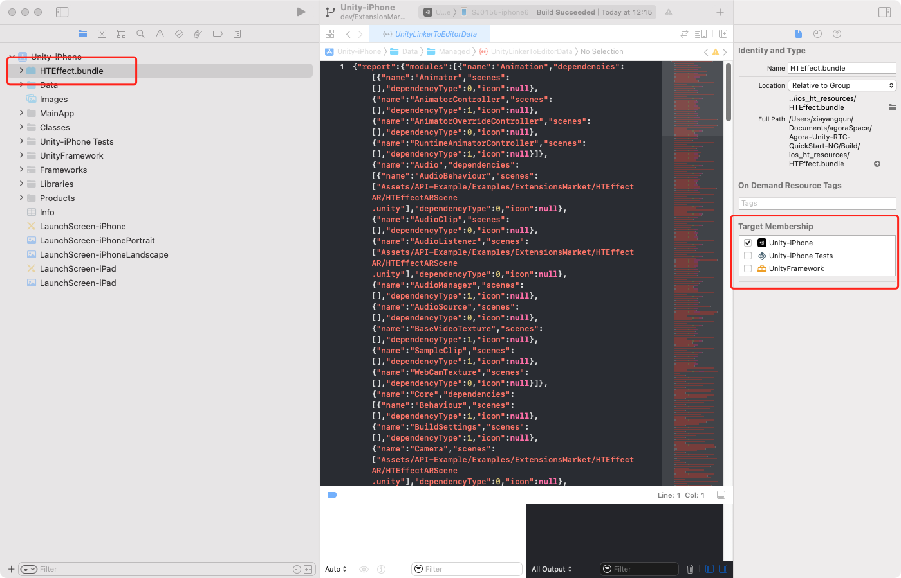
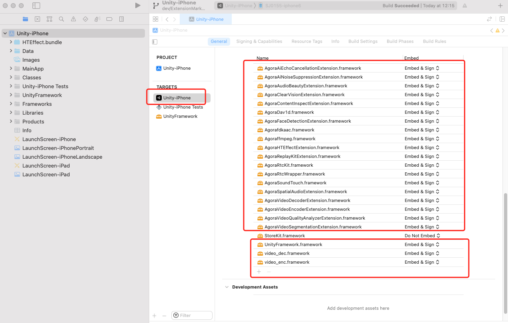
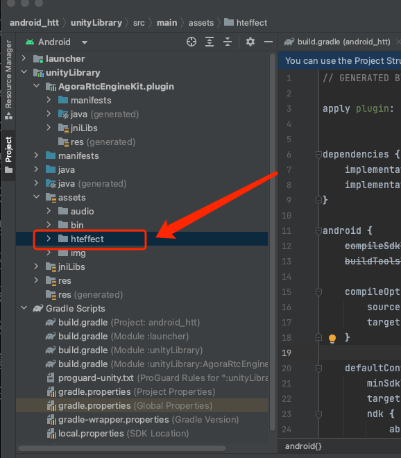
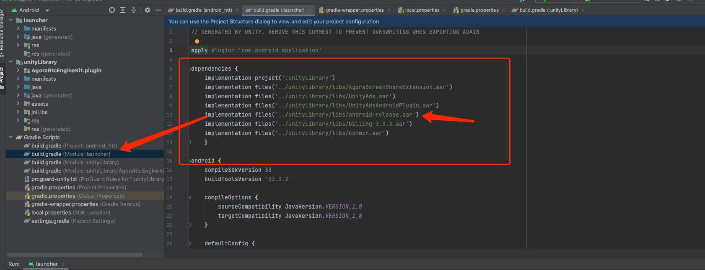

# 虹图美颜集成指南  
虹图美颜插件目前支持IOS端和Android端两个平台，接下来我们将介绍如何在两端分别集成该插件。


## 1. Unity Editor 操作
1. 首先下载Agora Unity RTC SDK。本次测试使用的是[Unity Rtc SDK 4.1.1.20版本](https://download.agora.io/sdk/release/Agora_Unity_RTC_SDK_v4.1.1.20_FULL.zip)(当然你也可以自由选择任意版本的Unity RTC SDK) 

2. 将下载好的SDK导入至本Demo中。因为Unity RTC SDK的unitypackage文件中包含了Example的部分。所以导入SDK时，注意只勾选<font color=green>**Agora-RTC-Plugin/Agora-Unity-RTC-SDK**</font>文件夹下的资源导入即可。不要勾选<font color=red>**Agora-RTC-Plugin/API-Example**</font>文件夹下的任何资源导入。

3. 如果Unity Editor产生了任何的编译报错。请直接删除掉<font color=red>**Assets/API-Example/Examples/Advanced**</font>和<font color=red>**Assets/API-Example/Examples/Advanced**</font>这2个文件夹即可。

4. 在Unity Editor的Player Settings中设置<font color=green>**Product Name**</font>和<font color=green>**Package Name**</font>为美颜插件申请授权时所填写的对应的名字。如果没有正确的设置好上述两项。会导致<font color=red>鉴权插件失败</font>，请务必设置好。

5. 编辑<font color=green>**HTEffectARScene**</font>场景文件，在场景的输入框内。依次填写本次测试所使用到的 <font color=green>RTC AppId, RTC频道名字, RTC频道Token</font>等关键信息。并将<font color=green>**HTEffectARScene**</font>在Player Settings设置为<font color=green>首选场景</font>。

6. 打开<font color=green>**HTEffectARSceneSample.cs**</font>文件，在第86行和第88行，填上你获得的插件离线验证的license。


## 2. IOS端操作
### 说明
1. 虹图美颜插件资源在IOS端分为代码库资源和特效资源两种。
2. 你可以从[gitee](https://gitee.com/htai-open/agora-texel-joy-extension/tree/master/ios/ALL_ARCHITECTURE/Release)下载所有的IOS的代码库文件，或者从技术支持那里直接获取。一般文件名字为*.framework，或者*.xcframework。
3. 将下载下来所有的代码库资源拷贝到<font color=green>**Assets/Agora-RTC-Plugin/Agora-Unity-RTC-SDK/Plugins/ios**</font>文件夹下。(正常情况下，这里已经存在了许多*.framework或者*.xcframework)
4. 从技术支持获取到特效文件资源。解压后会得到一个<font color=green>**HTEffect.bundle**</font>文件夹。使用Unity Editor导出Xcode工程。打开Xcode工程后,右键工程Add File.选择该文件并将该该文件加入Xcode工程中。如图所示。


5. 再次检查Xcode工程中。我们<font color=green>**Assets/Agora-RTC-Plugin/Agora-Unity-RTC-SDK/Plugins/ios**</font>文件夹下所有的库都已经被设置为<font color=green>**Embed & Sign**</font>


6. 在IOS真机上调试。
    1. 首先点击 <kbd>Init Rtc Engine</kbd> 按钮。初始化Rtc SDK.
    2. 接着点击 <kdb>InitExtension</kbd> 按钮。进行插件的鉴权。此时观察Xcode的日志输出窗口。应该可以看到如下的输出。其中initInfo为2，大于0则表示鉴权成功。小于等于0则为鉴权失败。如果失败的话，可以从日志输出窗口中获取更多信息。
    ```
    OnExtensionEvent Texeljoy, HTEffect, htInitHTEffectOfflineResult, {
         "initInfo" : 2
    }
    ```
    3. 鉴权成功后，点击 <kbd>Join Channel</kbd> 按钮后加入频道，此时屏幕上会出现本地图像的预览。

    4. 点击 <kbd>StartEffect</kbd> 按钮开启插件效果，此时可以观察到本地图像添加了旧照片风格。


## 3. Android端操作
### 说明
1. 虹图美颜插件资源在Android端分为代码库资源和特效资源两种。

2. 你可以从[gitee](https://gitee.com/htai-open/agora-texel-joy-extension/tree/master/android/ALL_ARCHITECTURE)下载所有的Android的代码库文件，或者从技术支持那里直接获取。一般文件名字为*.aar。

3. 将下载下来所有的代码库资源拷贝到<font color=green>**Assets/Agora-RTC-Plugin/Agora-Unity-RTC-SDK/Plugins/Android**</font>文件夹下。

4. 导出Android Studio工程。

5. 从技术支持获取到特效文件资源。解压后会得到一个<font color=green>**assets/hteffect**</font>文件夹。将<font color=green>**hteffect**</font>文件夹整个拷贝到Android Studio工程的<font color=green>**unityLibrary/src/main/assets**</font>文件夹下。如下图所示


6. 保证Android Studio工程中确实引用到了刚才导入的*.aar文件。如图所示。(不同版本的Unity导出的格式可能不同，需要视情况而定)


7. 在Android真机上调试。
    1. 首先点击 <kbd>Init Rtc Engine</kbd> 按钮。初始化Rtc SDK。此时会弹出摄像头授权窗口。给与权限后。请再次点击一次 <kbd>Init Rtc Engine</kbd> 按钮，此时会再次申请麦克风权限。
    demo这里简化了摄像头和麦克风的权限申请，请在自己的项目中选择合适的时机去申请摄像头和麦克风权限。
    2. 接着点击 <kdb>InitExtension</kbd> 按钮。进行插件的鉴权。此时观察Xcode的日志输出窗口。应该可以看到如下的输出。其中initInfo为2，大于0则表示鉴权成功。小于等于0则为鉴权失败。如果失败的话，可以从日志输出窗口中获取更多信息。
    ```
    OnExtensionEvent Texeljoy, HTEffect, htInitHTEffectOfflineResult, {
         "initInfo" : 2
    }
    ```
    3. 鉴权成功后，点击 <kbd>Join Channel</kbd> 按钮后加入频道，此时屏幕上会出现本地图像的预览。

    4. 点击 <kbd>StartEffect</kbd> 按钮开启插件效果，此时可以观察到本地图像添加了旧照片风格。


