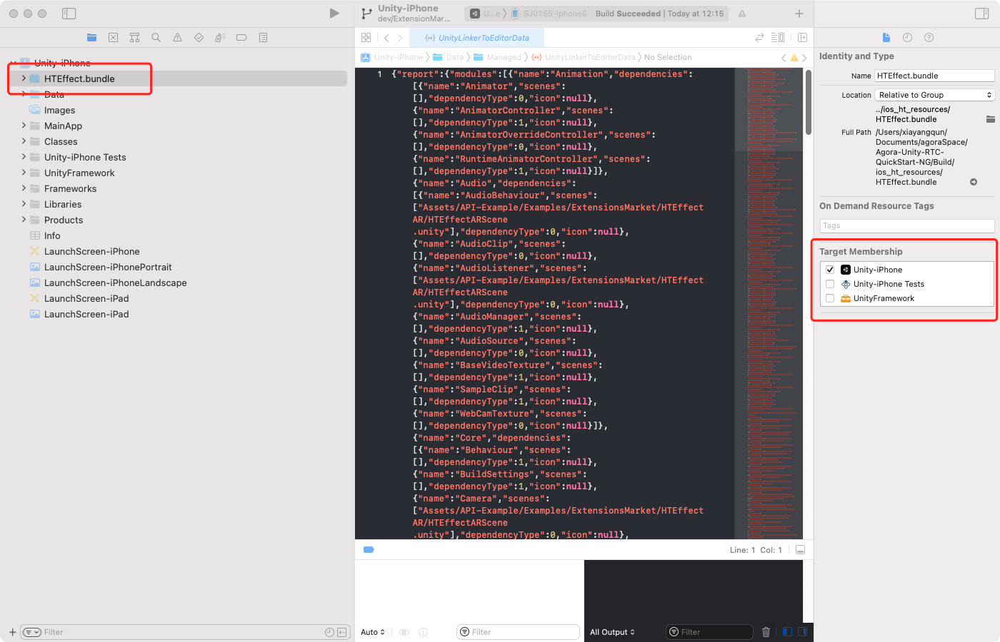
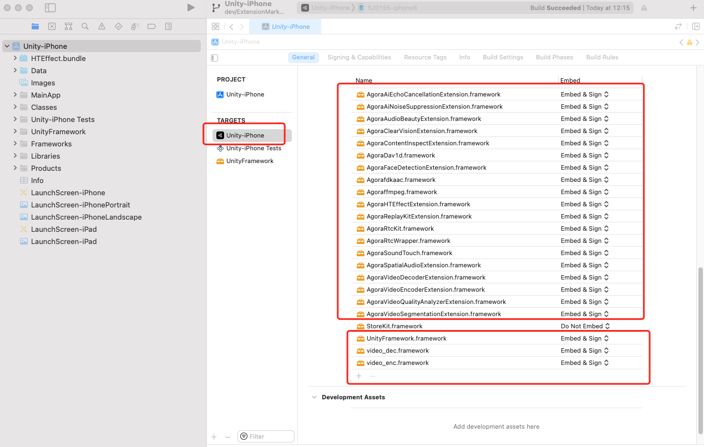

# HTEffect AR Extension Guide
The HTEffect AR extension currently supports both iOS and Android platforms. This guide outlines the steps for integrating this extension on both platforms.

## 1. Operations in Unity Editor 
1. First, download the Agora Unity RTC SDK. For this test, the [Unity Rtc SDK version 4.1.1.20](https://download.agora.io/sdk/release/Agora_Unity_RTC_SDK_v4.1.1.20_FULL.zip) is used (Of course, you can freely choose any version of the Unity RTC SDK).

2. Import the Agora Unity RTC SDK into this Demo. Since the unitypackage file of Unity RTC SDK includes the Example part, when importing the SDK, please be sure to select only the resources under the <font color=green>**Agora-RTC-Plugin/Agora-Unity-RTC-SDK**</font> folder for import. Do not select any resources under the <font color=red>**Agora-RTC-Plugin/API-Example**</font> folder.

3. If Unity Editor throws any compilation errors, simply delete the <font color=red>**Assets/API-Example/Examples/Advanced**</font> and <font color=red>**Assets/API-Example/Examples/Advanced**</font> folders.

4. In Unity Editor's Player Settings, set the <font color=green>**Product Name**</font> and <font color=green>**Package Name**</font> to the corresponding names filled in when applying for the extension authorization. If the above two items are not correctly set, it will lead to <font color=red>authentication failure</font>, so please be sure to set them correctly.

5. Edit the <font color=green>**HTEffectARScene**</font> scene file, fill in the <font color=green>RTC App ID, RTC channel name, RTC channel Token</font> and other key information in the scene's input box. And set <font color=green>**HTEffectARScene**</font> as the <font color=green>preferred scene</font> in Player Settings.

6. Open the <font color=green>**HTEffectARSceneSample.cs**</font> file, and on lines 86 and 88, fill in the offline verification license you obtained for this extension.

## 2. Operations for iOS
### Description
1. HTEffect AR extension resources for iOS are divided into codebase resources and special effects resources.

2. You can download all iOS codebase files from [gitee](https://gitee.com/htai-open/agora-texel-joy-extension/tree/master/ios/ALL_ARCHITECTURE/Release), or get them directly from technical support. Generally, the filenames are *.framework or *.xcframework.

3. Copy all codebase files to the <font color=green>**Assets/Agora-RTC-Plugin/Agora-Unity-RTC-SDK/Plugins/ios**</font> folder. (Normally, there are already many *.framework or *.xcframework here)

4. Get the special effects resources file from technical support. After decompressing, you will get a <font color=green>**HTEffect.bundle**</font> folder. Use Unity Editor to export the Xcode project. After opening the Xcode project, right-click the project and Add File. Select this file and add it to the Xcode project, as shown in the picture.


5. Check again in the Xcode project. All the codebases in our <font color=green>**Assets/Agora-RTC-Plugin/Agora-Unity-RTC-SDK/Plugins/ios**</font> folder have been set to <font color=green>**Embed & Sign**</font>


6. Debugging on iOS real device.
    1. First, click the <kbd>Init Rtc Engine</kbd> button to initialize the Rtc SDK.
    2. Then click the <kdb>InitExtension</kbd> button for authentication. At this time, in the Xcode log output window, you should see the following output. Where initInfo is 2. If it is greater than 0 , it means authentication is successful. If it is less than or equal to 0, it means authentication failure. If it fails, you can get more information from the log output window.
    ```
    OnExtensionEvent Texeljoy, HTEffect, htInitHTEffectOfflineResult, {
         "initInfo" : 2
    }
    ```
    3. After successfully authenticated, click the <kbd>Join Channel</kbd> button to join the channel, at this time the local image preview will appear on the screen.

    4. Click the <kbd>StartEffect</kbd> button to turn on the special effect, then you can observe that the local image has added an old-photo filter.

## 3. Operations for Android 
### Description
1. HTEffect AR extension resources for Android are divided into codebase resources and special effects resources.

2. You can download all Android codebase files from [gitee](https://gitee.com/htai-open/agora-texel-joy-extension/tree/master/android/ALL_ARCHITECTURE), or get them directly from technical support. Generally, the filenames are *.aar.

3. Copy all downloaded codebase files to the <font color=green>**Assets/Agora-RTC-Plugin/Agora-Unity-RTC-SDK/Plugins/Android**</font> folder.

4. Export the Android Studio project.

5. Get the special effect file resources from technical support. After decompressing, you will get a <font color=green>**assets/hteffect**</font> folder. Copy the entire <font color=green>**hteffect**</font> folder to the <font color=green>**unityLibrary/src/main/assets**</font> folder of the Android Studio project, as shown in the picture.


6. Ensure that the Android Studio project has indeed referenced the *.aar files that were just imported. As shown in the picture. (Different versions of Unity exports may vary, and it needs to be determined depending on the situation)


7. Debugging on Android real device.
    1. First, click the <kbd>Init Rtc Engine</kbd> button to initialize the Rtc SDK. A camera authorization window will pop up. After granting permission, click the <kbd>Init Rtc Engine</kbd> button again, and this time microphone permission will be requested.
    In this demo, the application of camera and microphone permissions is simplified, please choose the appropriate time to apply for camera and microphone permissions in your project.
    2. Then click the <kdb>InitExtension</kbd> button for authentication. At this time, observe the Xcode log output window. You should see the following output. Where initInfo is 2, greater than 0 means authentication is successful. Less than or equal to 0 is authentication failure. If it fails, you can get more information from the log output window.
    ```
    OnExtensionEvent Texeljoy, HTEffect, htInitHTEffectOfflineResult, {
         "initInfo" : 2
    }
    ```
    3. After successfully authenticated, click the <kbd>Join Channel</kbd> button to join the channel, at this time the local image preview will appear on the screen.

    4. Click the <kbd>StartEffect</kbd> button to turn on the special effect, then you can observe that the local image has added an old-photo filter.
